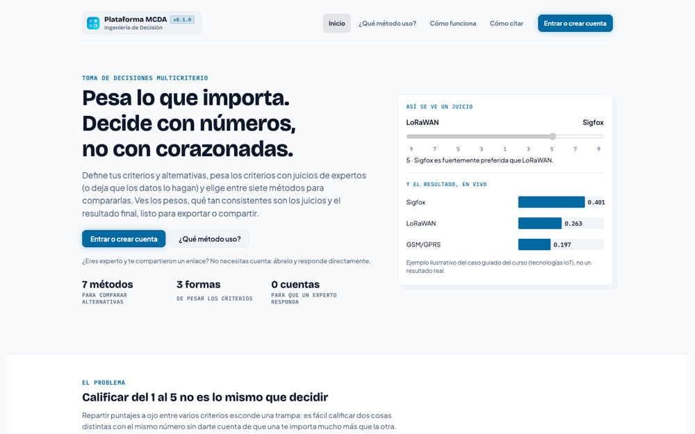
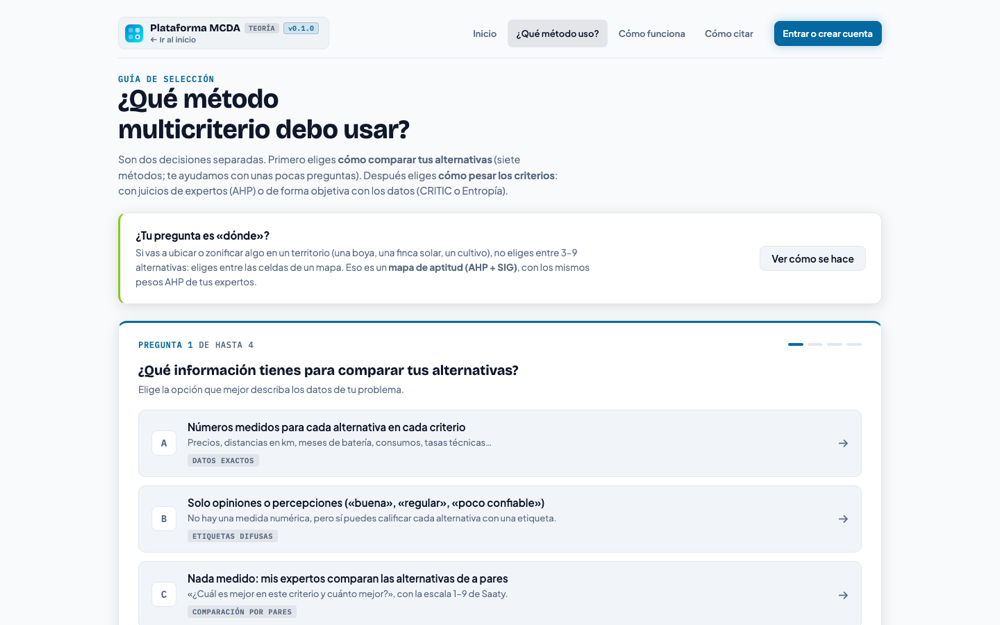
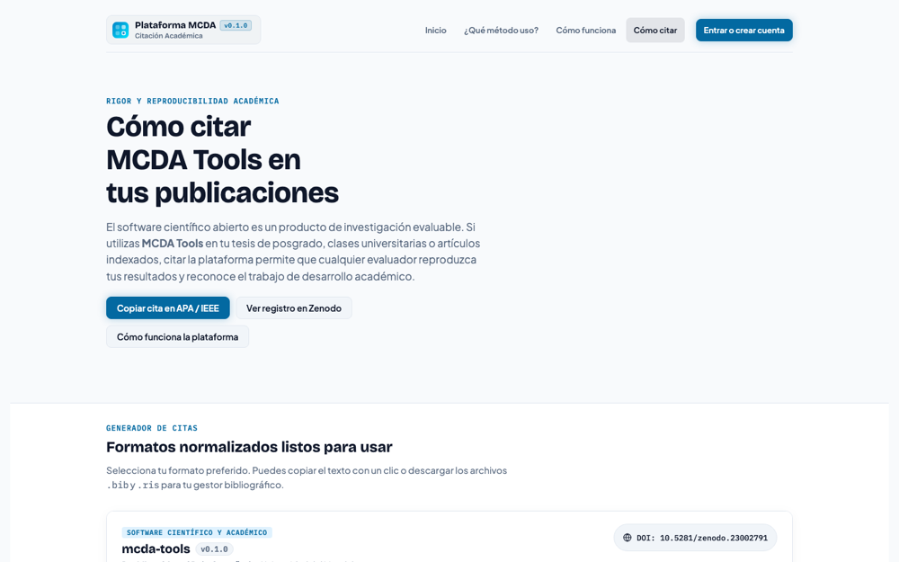

# MCDA Tools (`mcda.tools`)

> **Open-Source Web Platform for Multi-Criteria Decision Analysis (MCDA / MCDM) and Spatial Suitability Modeling.**

[](https://opensource.org/licenses/MIT)
[](https://github.com/miguepoloc/mcda-tools/actions/workflows/ci.yml)
[](https://doi.org/10.5281/zenodo.23002790)
[](https://github.com/miguepoloc/mcda-tools/releases)
[](https://nextjs.org/)
[](https://www.typescriptlang.org/)
[-336791?logo=postgresql)](https://supabase.com/)

**Live Production Deployment:** [https://mcda.tools](https://mcda.tools)  
**Source Repository:** [https://github.com/miguepoloc/mcda-tools](https://github.com/miguepoloc/mcda-tools)  
**Language:** [English](README.md) | [Español](README.es.md)

---

## Table of Contents

- [Overview](#overview)
- [Screenshots](#screenshots)
- [Key Differentiators](#key-differentiators)
- [Supported MCDA Methods](#supported-mcda-methods)
  - [1. Group Analytic Hierarchy Process (AHP)](#1-group-analytic-hierarchy-process-ahp)
  - [2. Multi-Method Matrix Engine](#2-multi-method-matrix-engine)
  - [3. Target Criteria (Nominal-the-Best)](#3-target-criteria-nominal-the-best)
  - [4. Spatial MCDA / Geoviewer (GIS + AHP)](#4-spatial-mcda--geoviewer-gis--ahp)
  - [5. Live-Formula Spreadsheet Engine (Excel)](#5-live-formula-spreadsheet-engine-excel)
- [Mathematical Verification & Ground Truth](#mathematical-verification--ground-truth)
- [Architecture & Tech Stack](#architecture--tech-stack)
- [Quick Start (Local Development)](#quick-start-local-development)
- [Database Setup & Migrations](#database-setup--migrations)
- [Production Deployment](#production-deployment)
- [Citation](#citation)
- [Contributing & License](#contributing--license)

---

## Overview

**MCDA Tools** is an academic-grade, open-source software platform designed to bridge the gap between rigorous mathematical Multi-Criteria Decision Analysis (MCDA / MCDM) algorithms and accessible, collaborative web workflows. 

Developed for graduate-level engineering decision analysis and applied research, the platform eliminates dependencies on expensive proprietary software (such as Expert Choice or Super Decisions) and desktop GIS installations (QGIS, ArcGIS) by running complete decision workflows directly inside modern web browsers with cloud synchronization.

---

## Screenshots

| Landing | Method selection wizard (`/metodo`) | Academic citation generator (`/citar`) |
|---|---|---|
| [](https://mcda.tools) | [](https://mcda.tools/metodo) | [](https://mcda.tools/citar) |

Live captures from the production deployment ([https://mcda.tools](https://mcda.tools)).

---

## Key Differentiators

1. **Zero-Installation Collaborative Expert Panels**:
   Invite external evaluators via private, tokenized survey links (`/e/<token>`). Experts submit pairwise comparisons without creating accounts or downloading software.
2. **Multi-Method Comparative Syntheses**:
   Solve the same decision problem across **7 ranking methods** (AHP, TOPSIS, VIKOR, ELECTRE I, PROMETHEE II, SAW, Fuzzy TOPSIS) with automated Spearman/Kendall ranking correlation.
3. **In-Browser Spatial MCDA (Geoviewer)**:
   Ingest raw raster and vector files (GeoTIFF, Shapefile .zip, GeoJSON, KML), reproject coordinates, compute exact Euclidean distance transforms, evaluate continuous membership functions, and calculate territorial suitability maps in seconds.
4. **Transparent, Live-Formula Excel Exports**:
   Exported workbooks contain **active native spreadsheet formulas** (`SUMPRODUCT`, `INDEX`, power iteration steps, conditional logic) rather than dead static values. Evaluators and auditors can verify or recalculate the decision offline.
5. **Privacy by Design**:
   PostgreSQL Row Level Security (RLS) guarantees that study owners only access their own data, and public links (`/p/<token>`) serve strictly anonymized consensus results.

---

## Supported MCDA Methods

### 1. Group Analytic Hierarchy Process (AHP)
- **Pairwise Judgments**: Standard Saaty 1–9 intensity scale with bidirectional verbal descriptors.
- **Priority Weight Computation**:
  - **Principal Eigenvector** (Saaty, 1980): Default computation using power iteration ($\mathbf{A} \mathbf{w} = \lambda_{\max} \mathbf{w}$).
  - **Normalized Column Average**: Pedagogical benchmark method.
- **Consistency Verification**: Calculation of Consistency Index ($CI$) and Consistency Ratio ($CR \le 0.10$) against Saaty's Random Index ($RI$) table.
- **Group Aggregation**: Multi-expert synthesis via geometric mean aggregation (AIJ / AIP).
- **Group Consensus & Uncertainty Diagnostics**:
  - Consensus Indicator $S^*$ based on Shannon entropy (Goepel, 2018).
  - Monte Carlo simulation to evaluate criteria weight uncertainty and rank stability.

### 2. Multi-Method Matrix Engine
When alternative evaluations are quantitative or empirical, criteria weights derived from AHP or objective weighting can be combined with a shared decision matrix:

- **TOPSIS** (Hwang & Yoon, 1981): Vector normalization, Euclidean distance to positive ($A^+$) and negative ($A^-$) ideal solutions, and relative closeness coefficient ($C_i$).
- **VIKOR** (Opricovic & Tzeng, 2004): Manhattan ($S_i$) and Chebyshev ($R_i$) distance metrics; compromise index $Q_i$; interactive weight of strategy $v \in [0, 1]$; automated verification of Condition 1 (*Acceptable Advantage*) and Condition 2 (*Acceptable Stability*); determination of the compromise solution set; sensitivity curves $Q(v)$.
- **ELECTRE I** (Roy, 1968): Concordance and discordance matrices with user-adjustable thresholds ($c^*, d^*$); outranking relations; graph kernel extraction identifying non-dominated, independent alternative subsets.
- **PROMETHEE II** (Brans & Vincke, 1985): Linear preference functions with indifference ($q$) and preference ($p$) thresholds; computation of positive flow ($\Phi^+$), negative flow ($\Phi^-$), and complete net ranking flow ($\Phi$).
- **SAW (Simple Additive Weighting)**: Linear max-min normalization and additive utility synthesis.
- **Fuzzy TOPSIS**: Triangular Fuzzy Numbers (TFN), linguistic variable evaluation, and fuzzy vertex distance to fuzzy ideal solutions.
- **Objective Weighting**: Integrated **CRITIC** (correlation and standard deviation) and **Shannon Entropy** methods.

### 3. Target Criteria (Nominal-the-Best)
Real-world engineering problems often require alternatives that match a specific nominal target value (e.g., maintaining grid voltage at $110\text{ V} \pm 5\%$ or soil pH at $6.5 \pm 0.5$). 

MCDA Tools natively supports **target-type** criteria with a user-defined tolerance band:
$$\text{Distance}(x) = \max(0, |x - \text{Target}| - \text{Tolerance})$$
This deviation metric is transformed into a standardized cost criterion before evaluation across all matrix methods.

### 4. Spatial MCDA / Geoviewer (GIS + AHP)
For territorial zoning and site selection problems where alternatives are geographic parcels or raster pixels:

- **Layer Ingestion**: Parses GeoTIFF (floating point and integer), Shapefile (.zip), GeoJSON, KML, and GPX directly inside the browser.
- **Coordinate Transformation**: Fast on-the-fly reprojection across UTM zones, MAGNA-SIRGAS, WGS84, and Web Mercator via `Proj4`.
- **Proximity Analysis**: Exact Euclidean distance transform using Felzenszwalb's algorithm.
- **Suitability Membership Modeling**:
  - Continuous Linear / Trapezoidal functions (more is better, less is better).
  - Piecewise step ranges (e.g., FAO / UPRA agroclimatic classes).
  - Target value matching with tolerance bounds.
  - Boolean exclusion masks and study area boundaries.
- **Interactive Geospatial Visualization**:
  - High-performance Leaflet raster overlay.
  - Point-and-click inspection revealing criteria breakdown and suitability score.
  - Area calculation (hectares and percentages) by suitability tier.
  - Identification of contiguous candidate patches above threshold areas.
- **Full GIS Export Suite**:
  - Georeferenced GeoTIFF (suitability 0–100 and discrete classification) accompanied by a QGIS style file (`.qml`).
  - Cartographic PNG map with title, scale bar, and legend.
  - Google Earth KMZ, pixel-level CSV grid, and structured Excel report.

### 5. Live-Formula Spreadsheet Engine (Excel)
Rather than exporting static tables, MCDA Tools generates `.xlsx` workbooks containing **live spreadsheet formulas**:
- Dynamic geometric mean, normalized sums, and eigenvector power iteration across 40 rows.
- Dynamic matrix normalizations, `SUMPRODUCT` utility sums, and nested conditional logic for compromise sets.
- Full round-trip re-import: workbooks can be exported, modified offline, and re-imported into the platform via the hidden `_datos` state sheet.

---

## Mathematical Verification & Ground Truth

To guarantee absolute scientific rigor, all algorithm implementations in TypeScript are continuously validated against independent ground-truth implementations:

1. **Python `pyDecision` Validation Suite** (`notebooks/`):
   Contains Jupyter notebooks running exact end-to-end models with `pyDecision`, `NumPy`, `rasterio`, and `Pandas`.
2. **Automated Unit Testing** (`npm test`):
   Tests all 7 MCDA methods, group consensus metrics, and geospatial raster/vector conversions against verified published benchmarks.
3. **Headless LibreOffice Recalculation Tests** (`npm run test:excel:recalc`):
   Destroys cached cell values and executes an automated macro inside LibreOffice headless to prove that spreadsheet formulas evaluate to the exact reference values independently of the web application.

---

## Architecture & Tech Stack

```text
mcda-tools/
├─ src/
│  ├─ app/             # Next.js 15 App Router pages & server routes
│  ├─ components/      # React 19 UI components (workspaces, editors, geoviewer)
│  └─ lib/             # Pure computational engines (ahp, topsis, vikor, geo, excel)
├─ public/             # Static assets and pre-computed geospatial reference packs
├─ supabase/
│  ├─ migrations/      # Versioned PostgreSQL schema migrations with RLS
│  └─ tests/           # PostgreSQL 17 test harness testing security and quotas
├─ scripts/            # Numerical unit checks, Excel validation, and fixtures
├─ notebooks/          # Python reference notebooks (ground truth benchmarks)
├─ docs/               # System architecture and academic publication plans
├─ CITATION.cff        # Citation File Format 1.2.0 metadata
└─ package.json        # Project metadata and dependencies
```

- **Frontend & Fullstack**: Next.js 15, React 19, TypeScript 5.6.
- **Database & Auth**: Supabase (PostgreSQL 17, Row Level Security, Auth, Storage).
- **Geospatial Processing**: Leaflet, GeoTIFF.js, Shpjs, Proj4, Canvas API.
- **Spreadsheet Generation**: `xlsx-js-style`.
- **Testing**: Node test runner with native experimental type stripping, LibreOffice headless.

---

## Quick Start (Local Development)

### 1. Prerequisites
- **Node.js** ≥ 22.0.0
- **npm** ≥ 10.0.0
- A free [Supabase](https://supabase.com) account (or a local PostgreSQL 17 instance)

### 2. Installation
```bash
# Clone the repository
git clone https://github.com/miguepoloc/mcda-tools.git
cd mcda-tools

# Install dependencies
npm ci

# Configure environment variables
cp .env.example .env.local
```

Edit `.env.local` with your Supabase project credentials:
```env
NEXT_PUBLIC_SUPABASE_URL=https://your-project.supabase.co
NEXT_PUBLIC_SUPABASE_ANON_KEY=your-anon-publishable-key
```

### 3. Launch Development Server
```bash
npm run dev
```
Open [http://localhost:3000](http://localhost:3000) in your browser.

### 4. Run Test Suites
```bash
# Typecheck
npm run typecheck

# Mathematical unit checks across all 7 methods and GIS routines
npm test

# Excel formula verification and round-trip tests
npm run test:excel

# Production build test
npm run build
```

---

## Database Setup & Migrations

If deploying your own Supabase instance:
1. Open the **SQL Editor** in your Supabase project dashboard.
2. Execute the migration scripts in [`supabase/migrations/`](supabase/migrations/) in numerical order (`000001` through `000015`).
3. Under **Authentication → URL Configuration**:
   - Set **Site URL** to `http://localhost:3000` (or your production domain).
   - Add `http://localhost:3000/auth/callback` to **Redirect URLs**.

To test database migrations and security policies locally against a disposable PostgreSQL 17 container:
```bash
npm run test:db
```

---

## Production Deployment

### Deploying on Vercel
1. Import the repository `miguepoloc/mcda-tools` into [Vercel](https://vercel.com/new).
2. Set **Root Directory** to `.` (the repository root).
3. Add the environment variables:
   - `NEXT_PUBLIC_SUPABASE_URL`
   - `NEXT_PUBLIC_SUPABASE_ANON_KEY`
4. Deploy. Then configure your custom domain in Vercel and add it to your Supabase Auth Redirect URLs.

---

## Citation

If you use **MCDA Tools** in academic courses, master's theses, or scientific research, please cite this software using the reference formats below:

### APA (7th Edition)
```text
Polo-Castañeda, M. A. (2026). mcda-tools: Open-source web platform for multi-criteria decision analysis (AHP, TOPSIS, VIKOR, ELECTRE, PROMETHEE, SAW, Fuzzy TOPSIS) and GIS-MCDA (Version 0.1.2) [Computer software]. Zenodo. https://doi.org/10.5281/zenodo.23003288
```

### IEEE
```text
M. A. Polo-Castañeda, "mcda-tools: Open-source web platform for multi-criteria decision analysis (AHP, TOPSIS, VIKOR, ELECTRE, PROMETHEE, SAW, Fuzzy TOPSIS) and GIS-MCDA," ver. 0.1.2, Zenodo, Sep. 2026. doi: 10.5281/zenodo.23003288. [Online]. Available: https://mcda.tools
```

### BibTeX
```bibtex
@software{polo_castaneda_2026_mcda_tools,
  author       = {Polo-Castañeda, Miguel Angel},
  title        = {{mcda-tools: Open-source web platform for multi-criteria decision analysis (AHP, TOPSIS, VIKOR, ELECTRE, PROMETHEE, SAW, Fuzzy TOPSIS) and GIS-MCDA}},
  year         = {2026},
  month        = sep,
  publisher    = {Zenodo},
  version      = {v0.1.2},
  doi          = {10.5281/zenodo.23003288},
  url          = {https://doi.org/10.5281/zenodo.23003288}
}
```

The formats above cite this exact version (v0.1.2). To always cite the latest release, use the concept DOI instead: [10.5281/zenodo.23002790](https://doi.org/10.5281/zenodo.23002790).

You can also generate these references (plus RIS / Chicago) directly from the platform at [`/citar`](https://mcda.tools/citar).

---

## Contributing & License

We welcome pull requests and feature contributions. Please review [CONTRIBUTING.md](CONTRIBUTING.md) and [CHANGELOG.md](CHANGELOG.md) for details on code style, ground-truth verification, and testing guidelines.

This project is licensed under the [MIT License](LICENSE).
